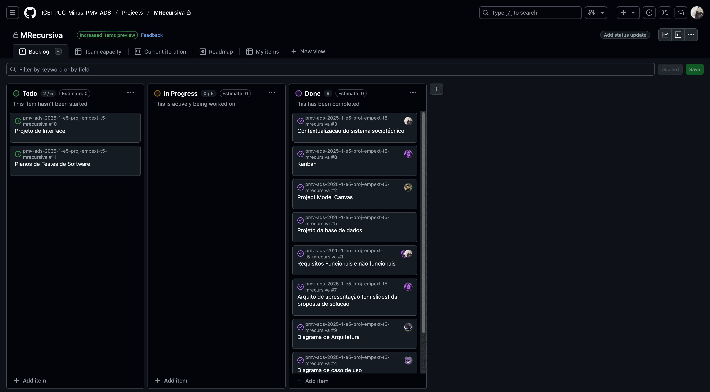

# Especificações do Projeto MRecursiva


Definição do problema e ideia de solução a partir da perspectiva do usuário. 

## Usuários
| Tipo de Usuário   | Descrição | Responsabilidades |
|------------------|-----------|------------------|
| **Administrador** | Responsável por gerenciar a plataforma, configurar modelos de avaliação e gerenciar usuários. | Configurar modelos de avaliação, gerenciar usuários, acessar relatórios gerais. |
| **Professor/Avaliador** | Usuário que cadastra e avalia objetos de aprendizagem. | Cadastrar objetos de aprendizagem, realizar avaliações, visualizar relatórios detalhados. |

## Arquitetura e Tecnologias

A plataforma será desenvolvida com uma arquitetura baseada em microsserviços, utilizando as seguintes tecnologias:
* **Frontend:** React.js (para uma interface responsiva e interativa).
* **Backend:** Node.js com Express (para gerenciamento de APIs e lógica de negócios).
* **Banco de Dados:** MongoDB (para armazenamento de dados não estruturados, como objetos de aprendizagem e avaliações).
* **Autenticação:** JWT (JSON Web Tokens) para segurança e controle de acesso.
* **Relatórios:** Chart.js (para geração de gráficos de radar e relatórios visuais).


>[!IMPORTANT]
>
>Um diagrama de componentes será criado para representar a interação entre os módulos da plataforma.

## Project Model Canvas

O **Project Model Canvas** será desenvolvido com base no microfundamento "Empreendedorismo e inovação". A proposta de solução será representada visualmente, destacando os seguintes elementos:

* **Proposta de Valor:** Avaliação colaborativa de objetos de aprendizagem para melhorar a qualidade educacional.

* **Segmentos de Clientes:** Professores, especialistas em educação e instituições de ensino.

* **Canais:** Plataforma online acessível via web.

* **Relacionamento com Clientes:** Suporte técnico e feedback contínuo.

* **Fontes de Receita:** Assinaturas premium ou parcerias com instituições educacionais.

* **Recursos Principais:** Banco de dados de objetos de aprendizagem, modelos de avaliação personalizáveis.

* **Atividades-Chave:** Desenvolvimento da plataforma, manutenção e atualização de critérios de avaliação.

* **Parcerias:** Parcerias com instituições educacionais e especialistas em pedagogia.

  

**Estrutura de Custos:** Desenvolvimento, hospedagem e manutenção da plataforma.

A estrutura de custos do projeto foi planejada para cobrir todos os aspectos necessários à criação e operação da plataforma, incluindo **desenvolvimento**, **hospedagem**, **registro de domínio**, **manutenção** e, de forma opcional, uma **caixa de email profissional**. Confira os detalhes abaixo:

- **Desenvolvimento:**  
  Custo estimado em **R$ 4.480,00**, baseado no trabalho de 6 alunos, com 1 hora diária cada, a R$ 16,00/hora, por 280 horas (aproximadamente 2,5 meses).

- **Hospedagem:**  
  Utilizando o plano básico da **railway.com**, ao custo de $5,00/mês (R$ 25,00, com 1 USD = 5 BRL). Para 6 meses, o total é de **R$ 150,00**.

- **Registro de Domínio:**  
  Registro de um domínio ".com.br" por R$ 40,00/ano, totalizando **R$ 40,00** para o primeiro ano.

- **Manutenção:**  
  Estimada em 10 horas/mês a R$ 16,00/hora, por 6 meses, resultando em **R$ 960,00**. Esse serviço não faz parte do escopo do  projeto sóciotécino de desenvolvimento, porém foi incluído por ser relevante no custo operacional)

- **Email Profissional (Opcional):**  
  Uma caixa de email profissional do Google Workspace, ao custo de $6,00/mês por usuário (R$ 30,00/mês, com 1 USD = 5 BRL). Para 6 meses, o custo total é de **R$ 180,00**. Esse serviço é opcional e pode ser adicionado para reforçar a identidade profissional do projeto.

#### Resumo dos Custos:
| **Componente**                         | **Custo (R$)** |
| -------------------------------------- | -------------- |
| Desenvolvimento                        | 4.480,00       |
| Hospedagem (6 meses)                   | 150,00         |
| Registro de Domínio (1 ano)            | 40,00          |
| Manutenção (6 meses)                   | 960,00         |
| Email Profissional (Opcional, 6 meses) | 180,00         |
| **Total (sem email)**                  | **5.630,00**   |
| **Total (com email)**                  | **5.810,00**   |


## Requisitos

As tabelas que se seguem apresentam os requisitos funcionais e não funcionais que detalham o escopo do projeto. Para determinar a prioridade de requisitos, aplicar uma técnica de priorização de requisitos e detalhar como a técnica foi aplicada.

Para mais informações, consulte os microfundamentos Fundamentos de Engenharia de Software e Engenharia de Requisitos de Software. 

### Requisitos Funcionais

| **ID**   | **Descrição do Requisito**                                                                                       | **Prioridade** |
|----------|---------------------------------------------------------------------------------------------------------------|----------------|
| **RF-001** | O sistema deve permitir que o administrador cadastre critérios de avaliação (questões), informando o texto do critério (máximo de 200 caracteres), o eixo associado (Pedagógico, Conteúdo, Interação ou Tecnológico) e uma descrição opcional (até 500 caracteres), com validação para evitar duplicatas no mesmo eixo e salvamento apenas após confirmação. | ALTA          |
| **RF-002** | O sistema deve permitir que o administrador cadastre modelos de avaliação, definindo um nome único (máximo de 50 caracteres) e o tipo de objeto de aprendizagem (ex.: jogo, aplicativo), selecionado a partir de uma lista pré-definida no sistema. | ALTA          |
| **RF-003** | O sistema deve permitir que o administrador configure as questões de um modelo de avaliação cadastrado, selecionando critérios previamente cadastrados, organizados nos eixos Pedagógico, Conteúdo, Interação e Tecnológico, com opção de associar ao menos um critério por eixo e validação e evitando configurações duplicadas no mesmo modelo. | ALTA          |
| **RF-004** | O sistema deve permitir que usuários cadastrem objetos de aprendizagem, informando nome, tipo (ex.: jogo, app), conteúdo abordado, faixa etária, tempo médio de duração (em minutos) e recursos necessários, com validação de campos obrigatórios. | ALTA          |
| **RF-005** | O sistema deve permitir que usuários avaliem objetos de aprendizagem, atribuindo notas de 1 a 5 (1 = Concordo totalmente; 5 = Discordo totalmente) a cada critério do modelo de avaliação selecionado, com opção de salvar e finalizar a avaliação. | ALTA          |
| **RF-006** | O sistema deve exibir relatório simplificado de avaliação, contendo as médias por eixo (Pedagógico, Conteúdo, Interação, Tecnológico), acessível na interface após a conclusão da avaliação. | MÉDIA         |
| **RF-007** | O sistema deve permitir que múltiplos usuários avaliem o mesmo objeto de aprendizagem, registrando cada avaliação separadamente no banco de dados, com limite de uma avaliação por usuário por objeto. | MÉDIA         |
| **RF-008** | O sistema deve recalcular a nota final de um objeto de aprendizagem automaticamente após cada nova avaliação, utilizando a média aritmética das notas de todos os avaliadores, com precisão de uma casa decimal (ex.: 4.3). | MÉDIA         |
| **RF-009** | O sistema deve exibir publicamente a nota média final de cada objeto de aprendizagem (ex.: 4.3/5.0) na interface de consulta, sem revelar detalhes das avaliações individuais ou gráficos. | BAIXA         |
| **RF-010** | O sistema deve permitir que o administrador cadastre novos usuários, inserindo nome, e-mail, senha e nível de permissão (administrador ou usuário), com envio de e-mail de confirmação ao novo usuário. | ALTA          |
| **RF-011** | O sistema deve fornecer ao proprietário (owner) do objeto de aprendizagem e o administrador acesso a um relatório detalhado das avaliações, exibindo gráficos de radar com médias por eixo (Pedagógico, Conteúdo, Interação, Tecnológico) e detalhes das notas por avaliação. | MÉDIA         |
| **RF-012** | O sistema deve permitir que o proprietário (owner) do objeto de aprendizagem baixe o relatório detalhado da sua avaliação em formato PDF, contendo os gráficos de radar por eixo e o texto analítico, gerado sob demanda com um botão de download na interface do relatório. | MÉDIA         |
| **RF-013** | O sistema deve permitir que usuários consultem objetos de aprendizagem cadastrados por meio de uma busca textual por nome ou filtro por tipo, conteúdo abordado e faixa etária, exibindo uma lista paginada com até 10 resultados por página. | BAIXA         |
| **RF-014** | O sistema deve armazenar todas as avaliações realizadas, associando-as ao objeto de aprendizagem, ao modelo de avaliação e ao usuário avaliador, com data e hora de criação registradas automaticamente. | MÉDIA         |
| **RF-015** | O sistema deve permitir que o administrador visualize uma lista de todos os objetos de aprendizagem cadastrados, com opção de ordenação por nome, nota média ou data de criação, e acesso ao relatório detalhado de cada um. | BAIXA         |
| **RF-016** | O sistema deve exigir autenticação de usuários via login com e-mail e senha (mínimo de 8 caracteres, incluindo pelo menos uma letra maiúscula e um número), com bloqueio após 5 tentativas inválidas por 15 minutos. | ALTA          |
| **RF-017** | O sistema deve permitir que o usuário altere a própria senha. | BAIXA         |

### Requisitos não Funcionais

|ID     | Descrição do Requisito  |Prioridade |
|-------|-------------------------|----|
|RNF-001| O sistema deve ser responsivo para rodar em um dispositivos móvel | ALTA | 
|RNF-002| O sistema deve processar requisições em no máximo 3 segundos. |  MÉDIA | 
|RNF-003| O sistema deve garantir a segurança dos dados dos usuários. Armazenar as senhas dos usuários no banco de dados utilizando um algoritmo de criptografia robusto, como o bcrypt, com aplicação de sal (salt) para aumentar a segurança contra ataques de força bruta e rainbow table. As senhas não devem ser armazenadas em texto puro ou com métodos de criptografia reversíveis, garantindo que, mesmo em caso de acesso não autorizado ao banco de dados, as credenciais permaneçam protegidas e ininteligíveis.|  ALTA | 
|RNF-004| O sistema deve ser compatível com os principais navegadores (Chrome, Firefox, Safari). |  MÉDIA | 
|RNF-005| O sistema deve garantir a conformidade com a Lei Geral de Proteção de Dados (LGPD), assegurando que os dados pessoais dos usuários sejam coletados, processados, armazenados e descartados de acordo com os princípios de privacidade e segurança estabelecidos pela legislação brasileira. Isso inclui a implementação de mecanismos para obtenção de consentimento explícito dos usuários, garantia de transparência no uso dos dados, e a capacidade de atender solicitações dos titulares de dados, como acesso, correção ou exclusão de informações pessoais, dentro dos prazos legais.| ALTA |


## Restrições

O projeto está restrito pelos itens apresentados na tabela a seguir.

|ID| Restrição                                             |
|--|-------------------------------------------------------|
|01| O projeto deverá ser entregue até o final do semestre |
|02| O desenvolvimento do backend será limitado a tecnologias específicas (Node.js e MongoDB). |
|03| A plataforma deve ser acessível apenas para usuários cadastrados.|


## Diagrama de Caso de Uso

   | **ID** | **Nome do Caso de Uso**           | **Ator**                        | **Descrição**                                                | **Pré-condições**                             | **Pós-condições**                                       |
   | ------ | --------------------------------- | ------------------------------- | ------------------------------------------------------------ | --------------------------------------------- | ------------------------------------------------------- |
   | UC-001 | Cadastrar Critério de Avaliação   | Administrador                   | Cadastra novos critérios de avaliação, associando-os a um dos eixos (Pedagógico, Conteúdo, Interação, Tecnológico). | Administrador autenticado.                    | Critério salvo e disponível para modelos.               |
   | UC-002 | Cadastrar Modelo de Avaliação     | Administrador                   | Cria um modelo de avaliação, definindo nome e tipo de objeto de aprendizagem (ex.: jogo, aplicativo). | Administrador autenticado.                    | Modelo salvo e configurável com critérios.              |
   | UC-003 | Configurar Modelo de Avaliação    | Administrador                   | Associa critérios cadastrados a um modelo, organizando-os nos quatro eixos. | Modelo de avaliação existente.                | Modelo pronto para uso em avaliações.                   |
   | UC-004 | Cadastrar Usuário                 | Administrador                   | Cadastra novos usuários, definindo nome, e-mail, senha e permissões. | Administrador autenticado.                    | Usuário criado e notificado por e-mail.                 |
   | UC-005 | Alterar Usuário                   | Administrador                   | Modifica dados de usuários existentes (nome, e-mail, permissões). | Usuário existente no sistema.                 | Alterações salvas e usuário notificado, se necessário.  |
   | UC-006 | Excluir Usuário                   | Administrador                   | Exclui usuários e suas avaliações associadas.                | Usuário existente no sistema.                 | Usuário removido e ação registrada em log.              |
   | UC-007 | Cadastrar Objeto de Aprendizagem  | Usuário                         | Cadastra um objeto de aprendizagem com nome, tipo, conteúdo, faixa etária e modelo de avaliação. | Usuário autenticado.                          | Objeto salvo; usuário torna-se proprietário.            |
   | UC-008 | Avaliar Objeto de Aprendizagem    | Usuário                         | Avalia um objeto, atribuindo notas de 1 a 5 aos critérios do modelo selecionado. | Objeto cadastrado; usuário não avaliou antes. | Avaliação registrada; nota média atualizada.            |
   | UC-009 | Visualizar Relatório Detalhado    | Usuário (Owner) / Administrador | Exibe relatório detalhado com gráficos de radar e texto analítico. | Objeto avaliado.                              | Relatório exibido com detalhes das avaliações.          |
   | UC-010 | Visualizar Nota Final Pública     | Usuário                         | Exibe a nota média final de um objeto de aprendizagem.       | Objeto avaliado.                              | Nota média exibida sem detalhes adicionais.             |
   | UC-011 | Baixar Relatório em PDF           | Usuário (Owner)                 | Permite baixar o relatório detalhado em PDF.                 | Relatório detalhado disponível.               | PDF gerado e baixado pelo usuário.                      |
   | UC-012 | Consultar Objetos de Aprendizagem | Usuário                         | Busca e filtra objetos por nome, tipo, conteúdo ou faixa etária. | -                                             | Lista paginada de objetos exibida.                      |
   | UC-013 | Compartilhar Resultados           | Usuário                         | Compartilha a nota final pública via link ou CSV.            | Objeto avaliado.                              | Link ou arquivo CSV gerado para compartilhamento.       |
   | UC-014 | Alterar Senha                     | Usuário                         | Altera a senha do usuário, seguindo políticas de segurança.  | Usuário autenticado.                          | Nova senha salva e criptografada.                       |
   | UC-015 | Autenticar no Sistema             | Usuário / Administrador         | Realiza login com e-mail e senha.                            | -                                             | Usuário autenticado e redirecionado à página principal. |
   | UC-016 | Visualizar Lista de Objetos       | Administrador                   | Exibe lista de todos os objetos cadastrados, com ordenação e acesso a relatórios. | Administrador autenticado.                    | Lista exibida com opções de interação.                  |


## Projeto da Base de Dados

O projeto da base de dados será baseado no modelo **Entidade-Relacionamento (ER)**, com as seguintes entidades principais:
1. **Usuários:** Armazena informações de administradores e professores/avaliadores.
2. **Objetos de Aprendizagem:** Armazena detalhes dos objetos cadastrados.
3. **Avaliações:** Armazena as avaliações realizadas pelos usuários.
4. **Modelos de Avaliação:** Armazena os critérios e eixos de avaliação configurados pelo administrador.

>[!important]
>
>As tabelas serão relacionadas através de chaves primárias e estrangeiras, garantindo a integridade dos dados.


```sql
-- -----------------------------------------------------
-- Schema mydb
-- -----------------------------------------------------
CREATE SCHEMA IF NOT EXISTS `mydb` DEFAULT CHARACTER SET utf8 ;
USE `mydb` ;

-- -----------------------------------------------------
-- Table `mydb`.`roles`
-- -----------------------------------------------------
CREATE TABLE IF NOT EXISTS `mydb`.`roles` (
  `id` INT NULL AUTO_INCREMENT,
  `name` VARCHAR(50) NOT NULL,
  PRIMARY KEY (`id`),
  UNIQUE INDEX `name_UNIQUE` (`name` ASC) VISIBLE)
ENGINE = InnoDB;


-- -----------------------------------------------------
-- Table `mydb`.`users`
-- -----------------------------------------------------
CREATE TABLE IF NOT EXISTS `mydb`.`users` (
  `id` INT NULL AUTO_INCREMENT,
  `name` VARCHAR(100) NOT NULL,
  `email` VARCHAR(100) NOT NULL,
  `password` VARCHAR(255) NOT NULL,
  `created_at` DATETIME NULL DEFAULT CURRENT_TIMESTAM,
  `roles_id` INT NOT NULL,
  PRIMARY KEY (`id`),
  INDEX `fk_users_roles_idx` (`roles_id` ASC) VISIBLE,
  UNIQUE INDEX `email_UNIQUE` (`email` ASC) VISIBLE,
  CONSTRAINT `fk_users_roles`
    FOREIGN KEY (`roles_id`)
    REFERENCES `mydb`.`roles` (`id`)
    ON DELETE NO ACTION
    ON UPDATE NO ACTION)
ENGINE = InnoDB;


-- -----------------------------------------------------
-- Table `mydb`.`axes`
-- -----------------------------------------------------
CREATE TABLE IF NOT EXISTS `mydb`.`axes` (
  `id` INT NULL AUTO_INCREMENT,
  `name` VARCHAR(100) NOT NULL,
  `description` TEXT NULL,
  PRIMARY KEY (`id`))
ENGINE = InnoDB;


-- -----------------------------------------------------
-- Table `mydb`.`criteria`
-- -----------------------------------------------------
CREATE TABLE IF NOT EXISTS `mydb`.`criteria` (
  `id` INT NULL AUTO_INCREMENT,
  `axes_id` INT NOT NULL,
  `name` VARCHAR(100) NOT NULL,
  `description` TEXT NULL,
  PRIMARY KEY (`id`),
  INDEX `fk_criteria_axes1_idx` (`axes_id` ASC) VISIBLE,
  CONSTRAINT `fk_criteria_axes1`
    FOREIGN KEY (`axes_id`)
    REFERENCES `mydb`.`axes` (`id`)
    ON DELETE NO ACTION
    ON UPDATE NO ACTION)
ENGINE = InnoDB;


-- -----------------------------------------------------
-- Table `mydb`.`evaluation_models`
-- -----------------------------------------------------
CREATE TABLE IF NOT EXISTS `mydb`.`evaluation_models` (
  `id` INT NULL AUTO_INCREMENT,
  `name` VARCHAR(100) NOT NULL,
  `description` TEXT NULL,
  `created_by` INT NOT NULL,
  `created_at` DATETIME NULL DEFAULT CURRENT_TIMESTAMP,
  `object_type` VARCHAR(50) NULL,
  PRIMARY KEY (`id`),
  INDEX `fk_evaluation_models_users1_idx` (`created_by` ASC) VISIBLE,
  CONSTRAINT `fk_evaluation_models_users1`
    FOREIGN KEY (`created_by`)
    REFERENCES `mydb`.`users` (`id`)
    ON DELETE NO ACTION
    ON UPDATE NO ACTION)
ENGINE = InnoDB;


-- -----------------------------------------------------
-- Table `mydb`.`model_criteria`
-- -----------------------------------------------------
CREATE TABLE IF NOT EXISTS `mydb`.`model_criteria` (
  `id` INT NULL AUTO_INCREMENT,
  `evaluation_models_id` INT NOT NULL,
  `criteria_id` INT NOT NULL,
  PRIMARY KEY (`id`),
  INDEX `fk_model_criteria_evaluation_models1_idx` (`evaluation_models_id` ASC) VISIBLE,
  INDEX `fk_model_criteria_criteria1_idx` (`criteria_id` ASC) INVISIBLE,
  UNIQUE INDEX `uq_model_criterion` (`evaluation_models_id` ASC, `criteria_id` ASC) VISIBLE,
  CONSTRAINT `fk_model_criteria_evaluation_models1`
    FOREIGN KEY (`evaluation_models_id`)
    REFERENCES `mydb`.`evaluation_models` (`id`)
    ON DELETE NO ACTION
    ON UPDATE NO ACTION,
  CONSTRAINT `fk_model_criteria_criteria1`
    FOREIGN KEY (`criteria_id`)
    REFERENCES `mydb`.`criteria` (`id`)
    ON DELETE NO ACTION
    ON UPDATE NO ACTION)
ENGINE = InnoDB;


-- -----------------------------------------------------
-- Table `mydb`.`learning_objects`
-- -----------------------------------------------------
CREATE TABLE IF NOT EXISTS `mydb`.`learning_objects` (
  `id` INT NULL AUTO_INCREMENT,
  `name` VARCHAR(150) NOT NULL,
  `description` TEXT NULL,
  `platform` VARCHAR(100) NULL,
  `age_range` VARCHAR(50) NULL,
  `duration_minutes` INT NULL,
  `created_by` INT NOT NULL,
  `created_at` DATETIME NULL DEFAULT CURRENT_TIMESTAMP,
  `models_id` INT NOT NULL,
  PRIMARY KEY (`id`),
  INDEX `fk_learning_objects_users1_idx` (`created_by` ASC) VISIBLE,
  INDEX `fk_learning_objects_evaluation_models1_idx` (`models_id` ASC) VISIBLE,
  CONSTRAINT `fk_learning_objects_users1`
    FOREIGN KEY (`created_by`)
    REFERENCES `mydb`.`users` (`id`)
    ON DELETE NO ACTION
    ON UPDATE NO ACTION,
  CONSTRAINT `fk_learning_objects_evaluation_models1`
    FOREIGN KEY (`models_id`)
    REFERENCES `mydb`.`evaluation_models` (`id`)
    ON DELETE NO ACTION
    ON UPDATE NO ACTION)
ENGINE = InnoDB;


-- -----------------------------------------------------
-- Table `mydb`.`evaluations`
-- -----------------------------------------------------
CREATE TABLE IF NOT EXISTS `mydb`.`evaluations` (
  `id` INT NULL AUTO_INCREMENT,
  `users_id` INT NOT NULL,
  `learning_objects_id` INT NOT NULL,
  `evaluation_models_id` INT NOT NULL,
  `general_comment` TEXT NULL,
  `created_at` DATETIME NULL DEFAULT CURRENT_TIMESTAMP,
  PRIMARY KEY (`id`),
  INDEX `fk_evaluations_users1_idx` (`users_id` ASC) VISIBLE,
  INDEX `fk_evaluations_learning_objects1_idx` (`learning_objects_id` ASC) VISIBLE,
  INDEX `fk_evaluations_evaluation_models1_idx` (`evaluation_models_id` ASC) VISIBLE,
  CONSTRAINT `fk_evaluations_users1`
    FOREIGN KEY (`users_id`)
    REFERENCES `mydb`.`users` (`id`)
    ON DELETE NO ACTION
    ON UPDATE NO ACTION,
  CONSTRAINT `fk_evaluations_learning_objects1`
    FOREIGN KEY (`learning_objects_id`)
    REFERENCES `mydb`.`learning_objects` (`id`)
    ON DELETE NO ACTION
    ON UPDATE NO ACTION,
  CONSTRAINT `fk_evaluations_evaluation_models1`
    FOREIGN KEY (`evaluation_models_id`)
    REFERENCES `mydb`.`evaluation_models` (`id`)
    ON DELETE NO ACTION
    ON UPDATE NO ACTION)
ENGINE = InnoDB;


-- -----------------------------------------------------
-- Table `mydb`.`evaluation_answers`
-- -----------------------------------------------------
CREATE TABLE IF NOT EXISTS `mydb`.`evaluation_answers` (
  `id` INT NULL AUTO_INCREMENT,
  `evaluations_id` INT NOT NULL,
  `criteria_id` INT NOT NULL,
  `score` TINYINT NOT NULL,
  PRIMARY KEY (`id`),
  INDEX `fk_evaluation_answers_evaluations1_idx` (`evaluations_id` ASC) VISIBLE,
  INDEX `fk_evaluation_answers_criteria1_idx` (`criteria_id` ASC) VISIBLE,
  UNIQUE INDEX `uq_evaluation_criterion` (`criteria_id` ASC, `evaluations_id` ASC) VISIBLE,
  CONSTRAINT `fk_evaluation_answers_evaluations1`
    FOREIGN KEY (`evaluations_id`)
    REFERENCES `mydb`.`evaluations` (`id`)
    ON DELETE NO ACTION
    ON UPDATE NO ACTION,
  CONSTRAINT `fk_evaluation_answers_criteria1`
    FOREIGN KEY (`criteria_id`)
    REFERENCES `mydb`.`criteria` (`id`)
    ON DELETE NO ACTION
    ON UPDATE NO ACTION)
ENGINE = InnoDB;


-- -----------------------------------------------------
-- Table `mydb`.`passport_tokens`
-- -----------------------------------------------------
CREATE TABLE IF NOT EXISTS `mydb`.`passport_tokens` (
  `id` INT NOT NULL,
  `users_id` INT NOT NULL,
  `token` TEXT NULL,
  `created_at` DATETIME NULL DEFAULT CURRENT_TIMESTAMP,
  `expires_at` DATETIME NULL,
  PRIMARY KEY (`id`),
  INDEX `fk_passport_tokens_users1_idx` (`users_id` ASC) VISIBLE,
  CONSTRAINT `fk_passport_tokens_users1`
    FOREIGN KEY (`users_id`)
    REFERENCES `mydb`.`users` (`id`)
    ON DELETE NO ACTION
    ON UPDATE NO ACTION)
ENGINE = InnoDB;


SET SQL_MODE=@OLD_SQL_MODE;
SET FOREIGN_KEY_CHECKS=@OLD_FOREIGN_KEY_CHECKS;
SET UNIQUE_CHECKS=@OLD_UNIQUE_CHECKS;


```


---

## Kanban


